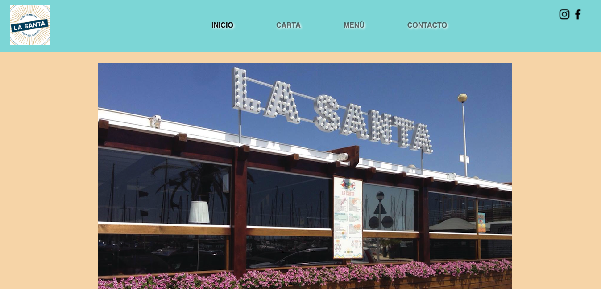
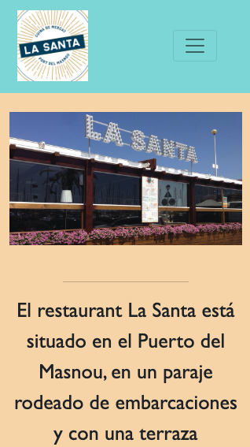
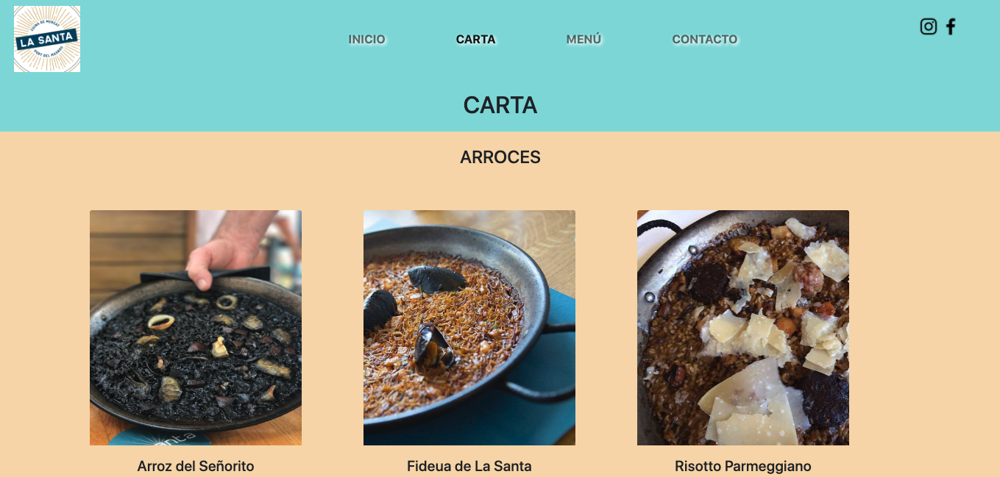

# Carta Restaurante Digital

  
Contenido 📝

  <ol>
    <li><a href="#objetivo-🎯">Objetivo</a></li>
    <li><a href="#sobre-el-proyecto-🔎">Sobre el proyecto</a></li>
    <li><a href="#stack">Stack</a></li>
    <li><a href="#vistas">Vistas</a></li>
    <li><a href="#contacto">Contacto</a></li>
  </ol>

## Objetivo 🎯
Desde producto nos piden crear una carta o menú de un restaurante digital,
en este caso para poner en práctica los conocimientos adquiridos en materia de
HTML5, CSS3, CSS Layout (Flexbox & Grid) además de Bootstrap.

## Sobre el proyecto 🔎
Decidí crear la web de un restaurante cercano a mi casa, el cual vi que no tiene web propia. 
Y lo dividí las siguientes pestañas:
- Inicio
- Carta
- Menús
- Contacto
  

## Stack

 

## Vistas
Landing
 
Vista Mobile

Landing Carta

## Contacto

